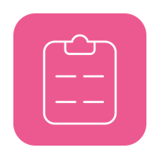

# testRegFormCloud

## :eyes: What is it:
- This is registration form with two routes and few steps in one of them.
- This project is a completed test task for Front Cloud Camp from [Cloud.ru](https://cloud.ru/).
Job description can be found [here](https://github.com/FrontCloudCamp/test-assignmentv) and
the design layout [here](https://www.figma.com/file/rzIp6awR6dGFVrcxcCEwzD/FrontCloudCamp?node-id=39%3A29554&mode=dev)

## :arrow_forward: How to use:
It was deployed using Github Pages. You can try it out [here](https://viwnu.github.io/testRegFormCloud/)
or deploy it locally using the cli commands:

```sh
npm install// for installing dependencies
npm run// for run dev server
```

## :hammer_and_wrench: Technologies that has been used:
This is SPA based on 
- [ React   ](https://react.dev/)
using the 
- [ React Router DOM   ](https://reactrouter.com/en/main), 
- [ Redux Tolkit  ](https://redux-toolkit.js.org/),
- and [ React Hook Form  ](https://react-hook-form.com/),
- Stylization is implemented with the help of a [ Styled Components   ](https://reactrouter.com/en/main).

## :gear: How it work:
The application is divided into components. It has a start page with fields for phone number and email and a page with a three step form. The transition between pages is implemented using react router home. The data is collected using react hook forms and stored using the redux tool kit (implemented caching of previously filled data into local storage).
The final step will send the data and show the modal window.